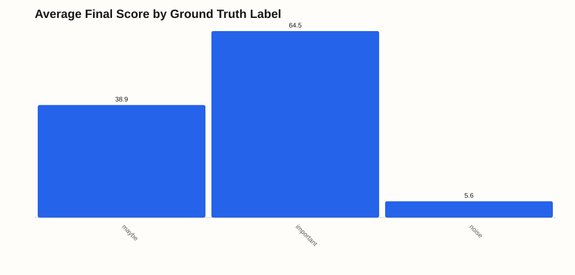
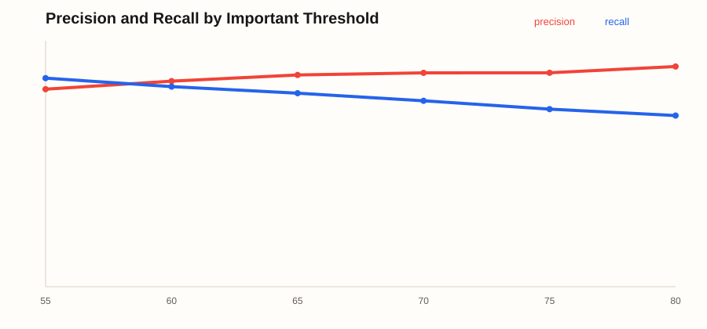
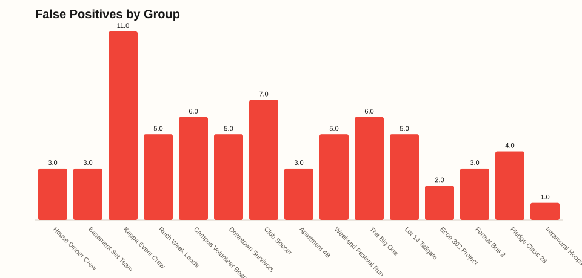
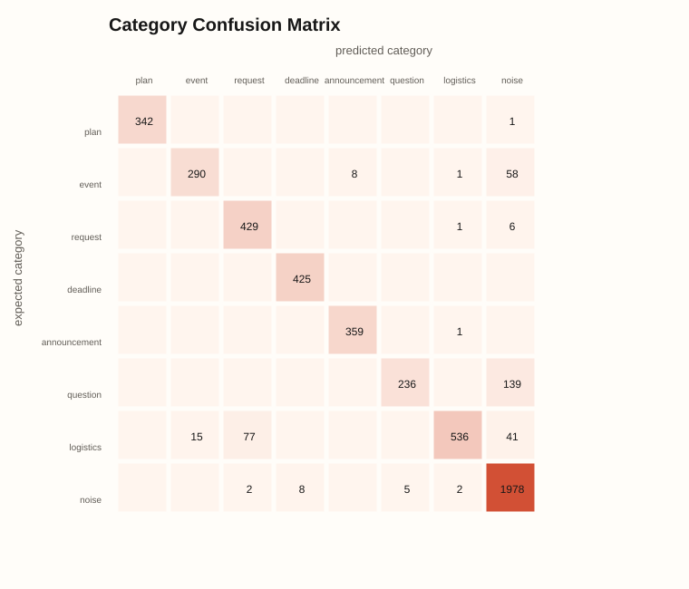
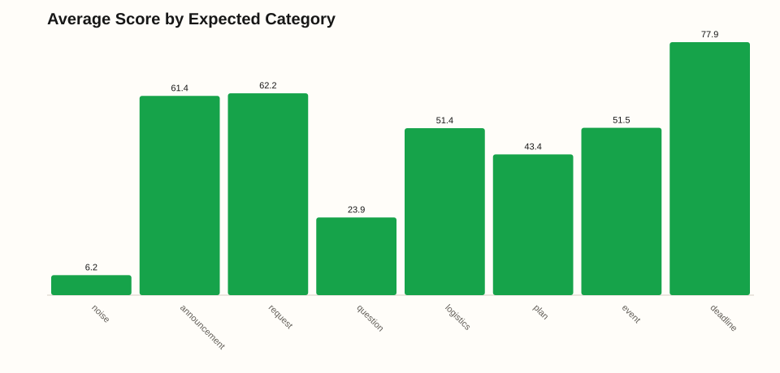
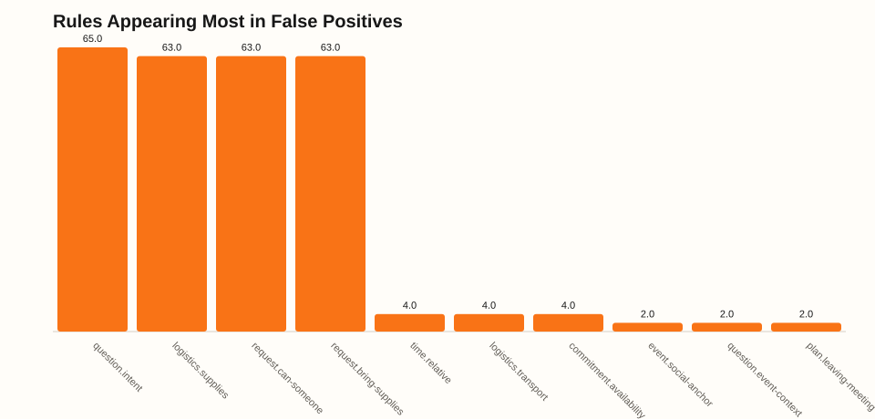

# CatchUp Algorithm Simulation Evaluation

## Executive Summary

Sprint 3.5 materially improved the rule-based scorer. The wide-net language layer expanded normalization, slang/typo handling, social-domain dictionaries, phrase families, combo rules, and false-positive guards. The result is not just a bigger test set; it is a harder test set with substantially better recall while preserving the precision target.

The current run generated 4960 messages across 25 social contexts, including 120 slang/typo stress messages, 170 domain-language stress messages, and 125 explicit false-positive traps. At threshold 65, precision is **86.1%** and recall is **78.7%**.

Compared with the previous simulation, recall at 65 rose from **53.9%** to **78.7%** (+24.8%), while precision moved from **86.8%** to **86.1%**. Edge/stress recall rose from **27.8%** to **77.3%** (+49.5%).

The biggest win is coverage: slang/typo stress recall is **82.5%**, domain-language stress recall is **72.4%**, and false-positive trap stress produced **0** Important-feed false positives. Funny/high-volume reactions promoted 0 pure-noise messages into Important.

Threshold guidance changed too: threshold 60 now has **83.6%** precision and **81.3%** recall, making it plausible for beta learning. Threshold 65 remains the more curated setting at **86.1%** precision and **78.7%** recall.

Bottom line: rule/regex still looks viable for Sprint 3.5. It is no longer just catching obvious phrases like `due tomorrow`; it now catches many messy variants like `tix due tmr`, `mtg moved room 204 tn`, `spkrs`, `prob set due tmr`, and compact domain phrases. The remaining risk is maintenance: this approach will keep needing real audit data and new phrase families as groups invent shorthand.

## Baseline Comparison

| Run | Messages | Groups | Precision @65 | Recall @65 | Category Acc | Edge Recall |
| --- | --- | --- | --- | --- | --- | --- |
| Previous simulation | 2745 | 15 | 86.8% | 53.9% | 87.4% | 27.8% |
| Current wide-net simulation | 4960 | 25 | 86.1% | 78.7% | 92.6% | 77.3% |

This comparison is intentionally not apples-to-apples: the current run casts a much wider net and adds hundreds of adversarial stress messages. If precision stays healthy while recall rises under a harder dataset, that is evidence the rule-based approach is becoming more viable rather than merely overfit to the first simulation.

## Simulation Methodology

- Seed: 20260604
- Simulated users: 28
- Simulated groups: 25
- Total messages: 4960
- Ground truth: 1683 important, 1383 maybe, 1894 noise
- Explicit edge cases: 460
- Slang/typo stress messages: 120
- Domain-language stress messages: 170
- False-positive trap messages: 125
- Reactions: 5028, assigned according to message context
- Replies: 744, assigned to prior messages in the same group
- Isolated database: `work\simulation\catchup-sim.sqlite`

Messages were generated from group-specific conversation templates plus an explicit adversarial edge-case suite. Every message carries ground truth importance, expected category, scenario tag, and notes. The simulation scores each message twice: once without reactions and once with simulated reactions, so the report can isolate reaction impact.

Ground truth labels mean: `important` should belong in the Important feed, `maybe` is useful context but not necessarily Important, and `noise` should stay out. This matters because a false positive can be either true junk or a maybe-useful message that the product chose to surface too aggressively.

## Charts

## Overall Metrics

| Threshold | Shown | Precision | Recall | False Positives | False Negatives | FPR | FNR |
| --- | --- | --- | --- | --- | --- | --- | --- |
| 65 | 1538 | 86.1% | 78.7% | 214 | 359 | 6.5% | 21.3% |

How to read this finding:

- Precision answers: when CatchUp shows a message in Important, how often is it truly important? Here, 86.1% means the feed is fairly trustworthy, but roughly 214 shown messages were still not ground-truth important.
- Recall answers: of all truly important messages, how many did CatchUp catch? Here, 78.7% means the algorithm missed 359 important messages, so the current system is more conservative than comprehensive.
- False positive rate is low at 6.5%, which is good for avoiding a junk-filled Important tab. False negative rate is high at 21.3%, which is the main product risk if users rely on CatchUp as their only way to catch up.
- Category accuracy at 92.6% means the scorer usually names the right kind of signal once it sees one, but category accuracy is less important than precision/recall for the core product promise.

## Threshold Sensitivity

| Threshold | Shown | Precision | Recall | False Positives | False Negatives |
| --- | --- | --- | --- | --- | --- |
| 55 | 1777 | 80.3% | 84.8% | 350 | 256 |
| 60 | 1638 | 83.6% | 81.3% | 269 | 314 |
| 65 | 1538 | 86.1% | 78.7% | 214 | 359 |
| 70 | 1463 | 86.9% | 75.6% | 191 | 411 |
| 75 | 1397 | 87.0% | 72.2% | 182 | 468 |
| 80 | 1308 | 89.5% | 69.6% | 137 | 512 |

What this means:

- Lower thresholds show more messages and recover more important content, but they also increase noise. Threshold 55 had the best F1 balance here because it caught 84.8% of important messages while keeping precision at 80.3%.
- The current threshold 65 is more precision-oriented: it shows 1538 messages, with 214 false positives and 359 false negatives. That is a deliberate "better to miss than flood" posture.
- Product decision: keep 65 if the Important tab must feel highly curated during early demos. Test 55 or 60 if users complain that CatchUp misses too many useful messages.

## Score By Ground Truth Label

| Label | Count | Avg Base | Avg Boost | Avg Final |
| --- | --- | --- | --- | --- |
| maybe | 1383 | 41.5 | 4.4 | 45.6 |
| important | 1683 | 76.6 | 11.9 | 82.5 |
| noise | 1894 | 1.6 | 1.0 | 2.6 |

Interpretation:

- Important messages average 82.5, which is comfortably above the current threshold. That explains the recall improvement: the wider language layer now lifts many variants that previously sat below Important.
- Maybe messages average 45.6, which is comfortably below Important. This is healthy because maybe-useful chatter should not dominate the feed.
- Noise averages 2.6, so the noise penalties and reaction caps are doing their basic job.
- The practical tuning target is not separating noise from important; that already works. The hard part is lifting terse but genuinely important logistics without also lifting vague maybe messages.

## Group-by-Group Breakdown

### Ava Birthday Ops

Type: Birthday/event planning group. Messages: 197. Active simulated users: 15. Mix: 67 important, 55 maybe, 75 noise.

Precision 74.5%, recall 52.2%, category accuracy 91.9%, average score 35.6. False positives: 12. False negatives: 32.

Finding: Lower precision means this group has language that makes maybe/noise messages look actionable. Middle recall means CatchUp catches obvious signal but misses a meaningful number of terse or context-heavy messages. False negatives are the first place to inspect if this group feels under-served; false positives are the first place to inspect if its Important tab feels noisy.

Representative messages:

| Text | Group | Expected | Score | Reactions | Rules |
| --- | --- | --- | --- | --- | --- |
| 😭😭😭 | Ava Birthday Ops | noise/noise | 0 (noise) | {} | normalization.alias (+4), noise.empty (-50), noise.one-word (-18), noise.emoji-only (-35), noise.vague-short (-12) |
| who let him cook? | Ava Birthday Ops | noise/noise | 0 (noise) | {} | question.intent (+10), noise.important-word-joke (-38), noise.casual-question (-14), noise.vague-short (-12) |
| need bro to retire | Ava Birthday Ops | noise/noise | 0 (noise) | {} | noise.important-word-joke (-38) |
| 🔥🔥🔥 | Ava Birthday Ops | noise/noise | 0 (noise) | {"😂":4,"💀":1} | normalization.alias (+4), noise.empty (-50), noise.one-word (-18), noise.emoji-only (-35), noise.vague-short (-12) |

### Pre-Med Service Crew

Type: Pre-med volunteering group. Messages: 196. Active simulated users: 15. Mix: 66 important, 55 maybe, 75 noise.

Precision 80.4%, recall 62.1%, category accuracy 96.4%, average score 40.0. False positives: 10. False negatives: 25.

Finding: Good precision means most surfaced messages are worth reading, though some maybe/noise items still leak in. Middle recall means CatchUp catches obvious signal but misses a meaningful number of terse or context-heavy messages. False negatives are the first place to inspect if this group feels under-served; false positives are the first place to inspect if its Important tab feels noisy.

Representative messages:

| Text | Group | Expected | Score | Reactions | Rules |
| --- | --- | --- | --- | --- | --- |
| I can drive after 10 | Pre-Med Service Crew | maybe/logistics | 42 (logistics) | {"😂":1} | logistics.transport (+20), commitment.availability (+22) |
| volunteer room changed to 214 | Pre-Med Service Crew | important/announcement | 100 (announcement) | {"✅":1} | announcement.change (+30), change.concrete-context (+24), announcement.room-location-update (+55) |
| I can drive after 10 | Pre-Med Service Crew | maybe/logistics | 42 (logistics) | {} | logistics.transport (+20), commitment.availability (+22) |
| deadline for being washed is tonight | Pre-Med Service Crew | noise/noise | 8 (noise) | {"🔥":4,"💀":4} | deadline.explicit (+32), time.relative (+8), deadline.date-context (+18), noise.hype-only (-24), noise.important-word-joke (-38) |

### Reservation Roulette

Type: Restaurant/dinner reservation group. Messages: 197. Active simulated users: 16. Mix: 67 important, 55 maybe, 75 noise.

Precision 80.8%, recall 62.7%, category accuracy 94.9%, average score 37.2. False positives: 10. False negatives: 25.

Finding: Good precision means most surfaced messages are worth reading, though some maybe/noise items still leak in. Middle recall means CatchUp catches obvious signal but misses a meaningful number of terse or context-heavy messages. False negatives are the first place to inspect if this group feels under-served; false positives are the first place to inspect if its Important tab feels noisy.

Representative messages:

| Text | Group | Expected | Score | Reactions | Rules |
| --- | --- | --- | --- | --- | --- |
| tomorrow gonna be wild | Reservation Roulette | noise/noise | 0 (noise) | {} | time.relative (+8), noise.hype-only (-24), noise.important-word-joke (-38) |
| where are we meeting? | Reservation Roulette | maybe/plan | 58 (plan) | {"❓":1,"😂":1} | event.social-anchor (+12), plan.leaving-meeting (+20), question.intent (+10), question.event-context (+8) |
| 🔥🔥🔥 | Reservation Roulette | noise/noise | 0 (noise) | {} | normalization.alias (+4), noise.empty (-50), noise.one-word (-18), noise.emoji-only (-35), noise.vague-short (-12) |
| what time are y'all leaving? | Reservation Roulette | maybe/plan | 34 (plan) | {} | normalization.alias (+4), plan.leaving-meeting (+20), question.intent (+10) |

### Bracket Weekend

Type: Intramural tournament group. Messages: 196. Active simulated users: 18. Mix: 66 important, 55 maybe, 75 noise.

Precision 81.3%, recall 59.1%, category accuracy 96.9%, average score 38.2. False positives: 9. False negatives: 27.

Finding: Good precision means most surfaced messages are worth reading, though some maybe/noise items still leak in. Middle recall means CatchUp catches obvious signal but misses a meaningful number of terse or context-heavy messages. False negatives are the first place to inspect if this group feels under-served; false positives are the first place to inspect if its Important tab feels noisy.

Representative messages:

| Text | Group | Expected | Score | Reactions | Rules |
| --- | --- | --- | --- | --- | --- |
| tipoff at 8 on court 3 | Bracket Weekend | important/event | 40 (event) | {} | event.starts-time (+28), time.explicit (+12) |
| no shot | Bracket Weekend | noise/noise | 0 (noise) | {} | noise.hype-only (-24), noise.vague-short (-12) |
| I could drive tomorrow | Bracket Weekend | maybe/logistics | 50 (logistics) | {"😂":1} | logistics.transport (+20), commitment.availability (+22), time.relative (+8) |
| tomorrow gonna be wild | Bracket Weekend | noise/noise | 0 (noise) | {} | time.relative (+8), noise.hype-only (-24), noise.important-word-joke (-38) |

### Senior Design Lab

Type: Engineering lab/project team. Messages: 196. Active simulated users: 16. Mix: 66 important, 55 maybe, 75 noise.

Precision 81.8%, recall 68.2%, category accuracy 90.8%, average score 39.3. False positives: 10. False negatives: 21.

Finding: Good precision means most surfaced messages are worth reading, though some maybe/noise items still leak in. Middle recall means CatchUp catches obvious signal but misses a meaningful number of terse or context-heavy messages. False negatives are the first place to inspect if this group feels under-served; false positives are the first place to inspect if its Important tab feels noisy.

Representative messages:

| Text | Group | Expected | Score | Reactions | Rules |
| --- | --- | --- | --- | --- | --- |
| can someone submit the final doc | Senior Design Lab | important/request | 88 (request) | {"👀":1} | deadline.payment (+18), request.can-someone (+24), question.intent (+10), deadline.object-context (+18), request.object-action (+10) |
| testing window starts at 6 | Senior Design Lab | important/event | 58 (event) | {"✅":1,"👀":1} | event.starts-time (+28), time.explicit (+12) |
| who has the speaker? | Senior Design Lab | maybe/question | 26 (question) | {"👀":1} | question.intent (+10), question.event-context (+8) |
| who has the speaker? | Senior Design Lab | maybe/question | 26 (question) | {"✅":1} | question.intent (+10), question.event-context (+8) |

### Kappa Event Crew

Type: Sorority event planning chat. Messages: 202. Active simulated users: 16. Mix: 69 important, 55 maybe, 78 noise.

Precision 82.9%, recall 98.6%, category accuracy 92.1%, average score 47.9. False positives: 14. False negatives: 1.

Finding: Good precision means most surfaced messages are worth reading, though some maybe/noise items still leak in. Strong recall means the scorer catches most important items in this context. False negatives are the first place to inspect if this group feels under-served; false positives are the first place to inspect if its Important tab feels noisy.

Representative messages:

| Text | Group | Expected | Score | Reactions | Rules |
| --- | --- | --- | --- | --- | --- |
| I could drive tomorrow | Kappa Event Crew | maybe/logistics | 50 (logistics) | {} | logistics.transport (+20), commitment.availability (+22), time.relative (+8) |
| forms are due by 5pm | Kappa Event Crew | important/deadline | 100 (deadline) | {"👀":1} | deadline.explicit (+32), deadline.payment (+18), time.explicit (+12), deadline.date-context (+18), deadline.object-context (+18) |
| forms are due by 5pm | Kappa Event Crew | important/deadline | 100 (deadline) | {"✅":1} | deadline.explicit (+32), deadline.payment (+18), time.explicit (+12), deadline.date-context (+18), deadline.object-context (+18) |
| who has the speaker? | Kappa Event Crew | maybe/question | 18 (noise) | {} | question.intent (+10), question.event-context (+8) |

### Rush Week Leads

Type: Recruitment logistics chat. Messages: 196. Active simulated users: 17. Mix: 66 important, 55 maybe, 75 noise.

Precision 83.8%, recall 86.4%, category accuracy 95.9%, average score 44.6. False positives: 11. False negatives: 9.

Finding: Good precision means most surfaced messages are worth reading, though some maybe/noise items still leak in. Strong recall means the scorer catches most important items in this context. False negatives are the first place to inspect if this group feels under-served; false positives are the first place to inspect if its Important tab feels noisy.

Representative messages:

| Text | Group | Expected | Score | Reactions | Rules |
| --- | --- | --- | --- | --- | --- |
| formal apology incoming | Rush Week Leads | noise/noise | 0 (noise) | {} | event.social-anchor (+12), noise.hype-only (-24), noise.important-word-joke (-38) |
| bro | Rush Week Leads | noise/noise | 3 (noise) | {"💀":3,"😂":3,"🔥":1} | noise.one-word (-18), noise.casual-reply (-28), noise.vague-short (-12) |
| bro said formal like he owns the place | Rush Week Leads | noise/noise | 6 (noise) | {"🔥":2,"💀":1} | event.social-anchor (+12), noise.important-word-joke (-38) |
| who all is going Friday? | Rush Week Leads | maybe/plan | 45 (plan) | {"👀":1,"😂":1} | plan.whos-going (+20), time.weekday (+7), question.intent (+10) |

### St. Mark Newman Center

Type: Church/Catholic center group. Messages: 196. Active simulated users: 18. Mix: 66 important, 55 maybe, 75 noise.

Precision 83.8%, recall 86.4%, category accuracy 89.3%, average score 44.2. False positives: 11. False negatives: 9.

Finding: Good precision means most surfaced messages are worth reading, though some maybe/noise items still leak in. Strong recall means the scorer catches most important items in this context. False negatives are the first place to inspect if this group feels under-served; false positives are the first place to inspect if its Important tab feels noisy.

Representative messages:

| Text | Group | Expected | Score | Reactions | Rules |
| --- | --- | --- | --- | --- | --- |
| service project forms due tonight | St. Mark Newman Center | important/deadline | 100 (deadline) | {"✅":1} | deadline.explicit (+32), deadline.payment (+18), event.social-anchor (+12), time.relative (+8), deadline.date-context (+18) |
| I could drive tomorrow | St. Mark Newman Center | maybe/logistics | 58 (logistics) | {"👀":1} | logistics.transport (+20), commitment.availability (+22), time.relative (+8) |
| need bro to retire | St. Mark Newman Center | noise/noise | 0 (noise) | {} | noise.important-word-joke (-38) |
| bring canned food to service tomorrow | St. Mark Newman Center | important/logistics | 100 (logistics) | {"✅":1} | logistics.supplies (+25), event.social-anchor (+12), time.relative (+8), event.concrete-time (+16), domain.action-time (+12) |

### Club Soccer

Type: Sports team. Messages: 202. Active simulated users: 15. Mix: 70 important, 57 maybe, 75 noise.

Precision 84.0%, recall 97.1%, category accuracy 88.1%, average score 47.0. False positives: 13. False negatives: 2.

Finding: Good precision means most surfaced messages are worth reading, though some maybe/noise items still leak in. Strong recall means the scorer catches most important items in this context. False negatives are the first place to inspect if this group feels under-served; false positives are the first place to inspect if its Important tab feels noisy.

Representative messages:

| Text | Group | Expected | Score | Reactions | Rules |
| --- | --- | --- | --- | --- | --- |
| no shot | Club Soccer | noise/noise | 0 (noise) | {} | noise.hype-only (-24), noise.vague-short (-12) |
| fire | Club Soccer | noise/noise | 0 (noise) | {} | noise.one-word (-18), noise.casual-reply (-28), noise.vague-short (-12) |
| 🔥🔥🔥 | Club Soccer | noise/noise | 0 (noise) | {} | normalization.alias (+4), noise.empty (-50), noise.one-word (-18), noise.emoji-only (-35), noise.vague-short (-12) |
| bring both jerseys tomorrow | Club Soccer | important/logistics | 100 (logistics) | {"📌":1} | logistics.supplies (+25), time.relative (+8), logistics.supply-context (+12), logistics.direct-supply-command (+28), structure.concrete-details (+8) |

### House Dinner Crew

Type: Food/social planning chat. Messages: 196. Active simulated users: 16. Mix: 66 important, 55 maybe, 75 noise.

Precision 84.1%, recall 80.3%, category accuracy 89.8%, average score 42.5. False positives: 10. False negatives: 13.

Finding: Good precision means most surfaced messages are worth reading, though some maybe/noise items still leak in. Strong recall means the scorer catches most important items in this context. False negatives are the first place to inspect if this group feels under-served; false positives are the first place to inspect if its Important tab feels noisy.

Representative messages:

| Text | Group | Expected | Score | Reactions | Rules |
| --- | --- | --- | --- | --- | --- |
| can someone bring plates | House Dinner Crew | important/request | 100 (request) | {} | request.can-someone (+24), logistics.supplies (+25), question.intent (+10), logistics.direct-supply-command (+28), request.bring-supplies (+14) |
| I can drive after 10 | House Dinner Crew | maybe/logistics | 42 (logistics) | {} | logistics.transport (+20), commitment.availability (+22) |
| absolute cinema | House Dinner Crew | noise/noise | 6 (noise) | {"🔥":2,"💀":3,"😂":3} | noise.hype-only (-24), noise.vague-short (-12) |
| are we still doing the same place? | House Dinner Crew | maybe/question | 10 (noise) | {"😂":1} | question.intent (+10) |

### Campus Volunteer Board

Type: Student organization/club. Messages: 202. Active simulated users: 18. Mix: 71 important, 56 maybe, 75 noise.

Precision 84.4%, recall 76.1%, category accuracy 96.0%, average score 44.9. False positives: 10. False negatives: 17.

Finding: Good precision means most surfaced messages are worth reading, though some maybe/noise items still leak in. Strong recall means the scorer catches most important items in this context. False negatives are the first place to inspect if this group feels under-served; false positives are the first place to inspect if its Important tab feels noisy.

Representative messages:

| Text | Group | Expected | Score | Reactions | Rules |
| --- | --- | --- | --- | --- | --- |
| meeting moved to the library room 310 | Campus Volunteer Board | important/announcement | 100 (announcement) | {"✅":1} | event.social-anchor (+12), announcement.change (+30), domain.action-time (+12), change.concrete-context (+24), announcement.room-location-update (+55) |
| rush hour traffic sucks | Campus Volunteer Board | noise/noise | 0 (noise) | {} | event.social-anchor (+12), noise.hype-only (-24), noise.important-word-joke (-38) |
| volunteer forms are due tomorrow | Campus Volunteer Board | important/deadline | 100 (deadline) | {"✅":1,"👀":1} | deadline.explicit (+32), deadline.payment (+18), time.relative (+8), deadline.date-context (+18), deadline.object-context (+18) |
| submit budget requests by Friday | Campus Volunteer Board | important/deadline | 100 (deadline) | {"👀":1} | deadline.explicit (+32), deadline.payment (+18), time.weekday (+7), deadline.date-context (+18), deadline.object-context (+18) |

### Morning Lift Crew

Type: Gym/workout group. Messages: 197. Active simulated users: 18. Mix: 67 important, 55 maybe, 75 noise.

Precision 85.7%, recall 35.8%, category accuracy 85.3%, average score 29.8. False positives: 4. False negatives: 43.

Finding: Good precision means most surfaced messages are worth reading, though some maybe/noise items still leak in. Low recall means this group uses wording the current rules do not understand well enough. False negatives are the first place to inspect if this group feels under-served; false positives are the first place to inspect if its Important tab feels noisy.

Representative messages:

| Text | Group | Expected | Score | Reactions | Rules |
| --- | --- | --- | --- | --- | --- |
| meet by the front desk at 6 | Morning Lift Crew | important/event | 58 (event) | {"✅":1} | event.arrival-departure (+34), time.explicit (+12) |
| does anyone have tickets left? | Morning Lift Crew | maybe/request | 45 (request) | {} | deadline.payment (+18), request.can-someone (+24), request.ticket-availability (+18), question.intent (+10), noise.ticket-availability-not-deadline (-25) |
| W | Morning Lift Crew | noise/noise | 0 (noise) | {} | noise.one-word (-18), noise.casual-reply (-28), noise.vague-short (-12) |
| lmao | Morning Lift Crew | noise/noise | 8 (noise) | {"😂":4,"💀":1,"🔥":3} | noise.one-word (-18), noise.laughter (-35), noise.vague-short (-12) |

### Apartment 4B

Type: Apartment/roommate chat. Messages: 201. Active simulated users: 15. Mix: 68 important, 55 maybe, 78 noise.

Precision 86.2%, recall 82.4%, category accuracy 91.0%, average score 42.6. False positives: 9. False negatives: 12.

Finding: Good precision means most surfaced messages are worth reading, though some maybe/noise items still leak in. Strong recall means the scorer catches most important items in this context. False negatives are the first place to inspect if this group feels under-served; false positives are the first place to inspect if its Important tab feels noisy.

Representative messages:

| Text | Group | Expected | Score | Reactions | Rules |
| --- | --- | --- | --- | --- | --- |
| I can bring cups | Apartment 4B | maybe/logistics | 75 (logistics) | {} | logistics.supplies (+25), commitment.availability (+22), logistics.direct-supply-command (+28) |
| cleaning inspection moved to Thursday | Apartment 4B | important/announcement | 83 (announcement) | {"👀":1} | announcement.change (+30), time.weekday (+7), change.concrete-context (+24), announcement.date-context (+14) |
| need bro to retire | Apartment 4B | noise/noise | 0 (noise) | {} | noise.important-word-joke (-38) |
| ???????? | Apartment 4B | noise/noise | 0 (noise) | {} | question.intent (+10), noise.one-word (-18), noise.repeated (-16), noise.vague-short (-12) |

### Arena Concert Run

Type: Concert/festival group. Messages: 197. Active simulated users: 15. Mix: 67 important, 55 maybe, 75 noise.

Precision 86.9%, recall 79.1%, category accuracy 91.9%, average score 40.3. False positives: 8. False negatives: 14.

Finding: Good precision means most surfaced messages are worth reading, though some maybe/noise items still leak in. Strong recall means the scorer catches most important items in this context. False negatives are the first place to inspect if this group feels under-served; false positives are the first place to inspect if its Important tab feels noisy.

Representative messages:

| Text | Group | Expected | Score | Reactions | Rules |
| --- | --- | --- | --- | --- | --- |
| yo | Arena Concert Run | noise/noise | 0 (noise) | {} | noise.one-word (-18), noise.casual-reply (-28), noise.vague-short (-12) |
| what time is tailgate again | Arena Concert Run | maybe/question | 30 (question) | {} | event.social-anchor (+12), question.intent (+10), question.event-context (+8) |
| I could drive tomorrow | Arena Concert Run | maybe/logistics | 50 (logistics) | {} | logistics.transport (+20), commitment.availability (+22), time.relative (+8) |
| set times posted doors at 8 | Arena Concert Run | important/announcement | 100 (announcement) | {"📌":1} | event.social-anchor (+12), event.starts-time (+28), announcement.change (+30), time.explicit (+12), event.concrete-time (+16) |

### Weekend Festival Run

Type: Festival/social trip chat. Messages: 196. Active simulated users: 17. Mix: 66 important, 55 maybe, 75 noise.

Precision 87.1%, recall 92.4%, category accuracy 89.3%, average score 42.1. False positives: 9. False negatives: 5.

Finding: Good precision means most surfaced messages are worth reading, though some maybe/noise items still leak in. Strong recall means the scorer catches most important items in this context. False negatives are the first place to inspect if this group feels under-served; false positives are the first place to inspect if its Important tab feels noisy.

Representative messages:

| Text | Group | Expected | Score | Reactions | Rules |
| --- | --- | --- | --- | --- | --- |
| might go downtown later | Weekend Festival Run | maybe/noise | 20 (noise) | {"👀":1,"😂":1} | event.social-anchor (+12) |
| tickets close tonight | Weekend Festival Run | important/deadline | 94 (deadline) | {} | deadline.explicit (+32), deadline.payment (+18), time.relative (+8), deadline.date-context (+18), deadline.object-context (+18) |
| where are we meeting? | Weekend Festival Run | maybe/plan | 58 (plan) | {"❓":1} | event.social-anchor (+12), plan.leaving-meeting (+20), question.intent (+10), question.event-context (+8) |
| pregame at the house? | Weekend Festival Run | maybe/question | 30 (question) | {} | event.social-anchor (+12), question.intent (+10), question.event-context (+8) |

### PCB Spring Break

Type: Spring break/trip planning group. Messages: 197. Active simulated users: 17. Mix: 67 important, 55 maybe, 75 noise.

Precision 87.8%, recall 64.2%, category accuracy 84.3%, average score 39.8. False positives: 6. False negatives: 24.

Finding: Good precision means most surfaced messages are worth reading, though some maybe/noise items still leak in. Middle recall means CatchUp catches obvious signal but misses a meaningful number of terse or context-heavy messages. False negatives are the first place to inspect if this group feels under-served; false positives are the first place to inspect if its Important tab feels noisy.

Representative messages:

| Text | Group | Expected | Score | Reactions | Rules |
| --- | --- | --- | --- | --- | --- |
| bring passport if you have one | PCB Spring Break | important/logistics | 8 (noise) | {"👀":1} |  |
| airbnb money due Friday | PCB Spring Break | important/deadline | 100 (deadline) | {"📌":1} | deadline.explicit (+32), deadline.payment (+18), time.weekday (+7), deadline.date-context (+18), deadline.object-context (+18) |
| bro said formal like he owns the place | PCB Spring Break | noise/noise | 0 (noise) | {} | event.social-anchor (+12), noise.important-word-joke (-38) |
| flight leaves at 6am | PCB Spring Break | important/event | 46 (event) | {} | event.arrival-departure (+34), time.explicit (+12) |

### Downtown Survivors

Type: College friend group. Messages: 202. Active simulated users: 17. Mix: 70 important, 55 maybe, 77 noise.

Precision 87.8%, recall 92.9%, category accuracy 93.1%, average score 44.4. False positives: 9. False negatives: 5.

Finding: Good precision means most surfaced messages are worth reading, though some maybe/noise items still leak in. Strong recall means the scorer catches most important items in this context. False negatives are the first place to inspect if this group feels under-served; false positives are the first place to inspect if its Important tab feels noisy.

Representative messages:

| Text | Group | Expected | Score | Reactions | Rules |
| --- | --- | --- | --- | --- | --- |
| are we still doing the same place? | Downtown Survivors | maybe/question | 18 (noise) | {"❓":1,"👀":1,"✅":1} | question.intent (+10) |
| why is bro like this? | Downtown Survivors | noise/noise | 3 (noise) | {"💀":1,"😂":1,"🔥":1} | question.intent (+10), noise.important-word-joke (-38) |
| meeting my downfall rn | Downtown Survivors | noise/noise | 26 (noise) | {} | normalization.alias (+4), event.social-anchor (+12), event.meeting-time (+24), time.explicit (+12), event.concrete-time (+16) |
| bring drinks if you have any | Downtown Survivors | maybe/logistics | 53 (logistics) | {"😂":1} | logistics.supplies (+25), logistics.direct-supply-command (+28) |

### Lot 14 Tailgate

Type: Tailgate/party planning chat. Messages: 201. Active simulated users: 18. Mix: 68 important, 55 maybe, 78 noise.

Precision 88.2%, recall 98.5%, category accuracy 95.0%, average score 43.9. False positives: 9. False negatives: 1.

Finding: Good precision means most surfaced messages are worth reading, though some maybe/noise items still leak in. Strong recall means the scorer catches most important items in this context. False negatives are the first place to inspect if this group feels under-served; false positives are the first place to inspect if its Important tab feels noisy.

Representative messages:

| Text | Group | Expected | Score | Reactions | Rules |
| --- | --- | --- | --- | --- | --- |
| setup moved to 10am | Lot 14 Tailgate | important/announcement | 100 (announcement) | {"✅":1,"👀":1} | announcement.change (+30), time.explicit (+12), change.concrete-context (+24), announcement.date-context (+14) |
| need two drivers for the cooler run | Lot 14 Tailgate | important/logistics | 95 (logistics) | {"✅":1} | request.concrete-need (+28), logistics.transport (+20), logistics.supplies (+25), request.object-action (+10) |
| what time is tailgate again | Lot 14 Tailgate | maybe/question | 30 (question) | {} | event.social-anchor (+12), question.intent (+10), question.event-context (+8) |
| party animal | Lot 14 Tailgate | noise/noise | 0 (noise) | {} | event.social-anchor (+12), noise.hype-only (-24), noise.important-word-joke (-38), noise.vague-short (-12) |

### Pledge Class 28

Type: Fraternity pledge chat. Messages: 202. Active simulated users: 15. Mix: 68 important, 56 maybe, 78 noise.

Precision 89.0%, recall 95.6%, category accuracy 96.5%, average score 45.9. False positives: 8. False negatives: 3.

Finding: Good precision means most surfaced messages are worth reading, though some maybe/noise items still leak in. Strong recall means the scorer catches most important items in this context. False negatives are the first place to inspect if this group feels under-served; false positives are the first place to inspect if its Important tab feels noisy.

Representative messages:

| Text | Group | Expected | Score | Reactions | Rules |
| --- | --- | --- | --- | --- | --- |
| might go downtown later | Pledge Class 28 | maybe/noise | 12 (noise) | {} | event.social-anchor (+12) |
| chapter moved to Thursday at 6 | Pledge Class 28 | important/announcement | 100 (announcement) | {"✅":1,"📌":1} | event.social-anchor (+12), event.meeting-time (+24), announcement.change (+30), time.weekday (+7), time.explicit (+12) |
| chapter moved to Thursday at 6 | Pledge Class 28 | important/announcement | 100 (announcement) | {"👀":1} | event.social-anchor (+12), event.meeting-time (+24), announcement.change (+30), time.weekday (+7), time.explicit (+12) |
| does anyone have tickets left? | Pledge Class 28 | maybe/request | 45 (request) | {} | deadline.payment (+18), request.can-someone (+24), request.ticket-availability (+18), question.intent (+10), noise.ticket-availability-not-deadline (-25) |

### The Big One

Type: Large chaotic general social chat. Messages: 201. Active simulated users: 16. Mix: 69 important, 55 maybe, 77 noise.

Precision 89.3%, recall 97.1%, category accuracy 94.5%, average score 46.9. False positives: 8. False negatives: 2.

Finding: Good precision means most surfaced messages are worth reading, though some maybe/noise items still leak in. Strong recall means the scorer catches most important items in this context. False negatives are the first place to inspect if this group feels under-served; false positives are the first place to inspect if its Important tab feels noisy.

Representative messages:

| Text | Group | Expected | Score | Reactions | Rules |
| --- | --- | --- | --- | --- | --- |
| need bro to retire | The Big One | noise/noise | 0 (noise) | {} | noise.important-word-joke (-38) |
| lol | The Big One | noise/noise | 0 (noise) | {} | noise.one-word (-18), noise.laughter (-35), noise.vague-short (-12) |
| are we still doing the same place? | The Big One | maybe/question | 10 (noise) | {} | question.intent (+10) |
| are we still doing the same place? | The Big One | maybe/question | 10 (noise) | {} | question.intent (+10) |

### Formal Bus 2

Type: Event transportation chat. Messages: 196. Active simulated users: 18. Mix: 66 important, 55 maybe, 75 noise.

Precision 89.9%, recall 93.9%, category accuracy 95.4%, average score 43.7. False positives: 7. False negatives: 4.

Finding: Good precision means most surfaced messages are worth reading, though some maybe/noise items still leak in. Strong recall means the scorer catches most important items in this context. False negatives are the first place to inspect if this group feels under-served; false positives are the first place to inspect if its Important tab feels noisy.

Representative messages:

| Text | Group | Expected | Score | Reactions | Rules |
| --- | --- | --- | --- | --- | --- |
| does anyone have tickets left? | Formal Bus 2 | maybe/request | 45 (request) | {} | deadline.payment (+18), request.can-someone (+24), request.ticket-availability (+18), question.intent (+10), noise.ticket-availability-not-deadline (-25) |
| who let him cook? | Formal Bus 2 | noise/noise | 0 (noise) | {} | question.intent (+10), noise.important-word-joke (-38), noise.casual-question (-14), noise.vague-short (-12) |
| pickup moved to the back lot | Formal Bus 2 | important/announcement | 100 (announcement) | {"✅":1,"👀":1} | logistics.transport (+20), announcement.change (+30), change.concrete-context (+24), structure.concrete-details (+8) |
| need one more sober driver | Formal Bus 2 | important/logistics | 100 (logistics) | {"📌":1} | request.concrete-need (+28), logistics.transport (+20), logistics.sober-drivers (+30), request.object-action (+10) |

### Basement Set Team

Type: DJ/promoter group. Messages: 201. Active simulated users: 16. Mix: 68 important, 57 maybe, 76 noise.

Precision 90.0%, recall 79.4%, category accuracy 94.5%, average score 43.0. False positives: 6. False negatives: 14.

Finding: Very high precision means this group's Important feed is trusted, but it may still miss quieter important messages. Strong recall means the scorer catches most important items in this context. False negatives are the first place to inspect if this group feels under-served; false positives are the first place to inspect if its Important tab feels noisy.

Representative messages:

| Text | Group | Expected | Score | Reactions | Rules |
| --- | --- | --- | --- | --- | --- |
| does anyone have tickets left? | Basement Set Team | maybe/request | 45 (request) | {"😂":1} | deadline.payment (+18), request.can-someone (+24), request.ticket-availability (+18), question.intent (+10), noise.ticket-availability-not-deadline (-25) |
| go go go go | Basement Set Team | noise/noise | 6 (noise) | {"😂":4,"🔥":2} | noise.repeated (-16), noise.vague-short (-12) |
| tickets close tonight | Basement Set Team | important/deadline | 94 (deadline) | {} | deadline.explicit (+32), deadline.payment (+18), time.relative (+8), deadline.date-context (+18), deadline.object-context (+18) |
| soundcheck at 5, doors at 8 | Basement Set Team | important/event | 100 (event) | {} | normalization.alias (+4), event.social-anchor (+12), event.starts-time (+28), event.compact-production-times (+50), time.explicit (+12) |

### Maple Hall 3

Type: Dorm floor chat. Messages: 196. Active simulated users: 17. Mix: 66 important, 55 maybe, 75 noise.

Precision 92.0%, recall 69.7%, category accuracy 95.4%, average score 37.4. False positives: 4. False negatives: 20.

Finding: Very high precision means this group's Important feed is trusted, but it may still miss quieter important messages. Middle recall means CatchUp catches obvious signal but misses a meaningful number of terse or context-heavy messages. False negatives are the first place to inspect if this group feels under-served; false positives are the first place to inspect if its Important tab feels noisy.

Representative messages:

| Text | Group | Expected | Score | Reactions | Rules |
| --- | --- | --- | --- | --- | --- |
| RA inspection tomorrow at 10am | Maple Hall 3 | important/event | 28 (event) | {"✅":1,"📌":1} | time.relative (+8), time.explicit (+12) |
| deadline for being washed is tonight | Maple Hall 3 | noise/noise | 0 (noise) | {} | deadline.explicit (+32), time.relative (+8), deadline.date-context (+18), noise.hype-only (-24), noise.important-word-joke (-38) |
| RA inspection tomorrow at 10am | Maple Hall 3 | important/event | 28 (event) | {"✅":1} | time.relative (+8), time.explicit (+12) |
| who all is going Friday? | Maple Hall 3 | maybe/plan | 37 (plan) | {} | plan.whos-going (+20), time.weekday (+7), question.intent (+10) |

### Econ 302 Project

Type: Group project/class chat. Messages: 201. Active simulated users: 17. Mix: 67 important, 57 maybe, 77 noise.

Precision 93.3%, recall 83.6%, category accuracy 93.0%, average score 41.6. False positives: 4. False negatives: 11.

Finding: Very high precision means this group's Important feed is trusted, but it may still miss quieter important messages. Strong recall means the scorer catches most important items in this context. False negatives are the first place to inspect if this group feels under-served; false positives are the first place to inspect if its Important tab feels noisy.

Representative messages:

| Text | Group | Expected | Score | Reactions | Rules |
| --- | --- | --- | --- | --- | --- |
| pregame at the house? | Econ 302 Project | maybe/question | 30 (question) | {} | event.social-anchor (+12), question.intent (+10), question.event-context (+8) |
| bro said formal like he owns the place | Econ 302 Project | noise/noise | 0 (noise) | {} | event.social-anchor (+12), noise.important-word-joke (-38) |
| who all is going Friday? | Econ 302 Project | maybe/plan | 45 (plan) | {"❓":1} | plan.whos-going (+20), time.weekday (+7), question.intent (+10) |
| 🔥🔥🔥 | Econ 302 Project | noise/noise | 0 (noise) | {} | normalization.alias (+4), noise.empty (-50), noise.one-word (-18), noise.emoji-only (-35), noise.vague-short (-12) |

### Intramural Hoops

Type: Sports pickup team. Messages: 196. Active simulated users: 15. Mix: 66 important, 55 maybe, 75 noise.

Precision 93.9%, recall 69.7%, category accuracy 94.4%, average score 39.5. False positives: 3. False negatives: 20.

Finding: Very high precision means this group's Important feed is trusted, but it may still miss quieter important messages. Middle recall means CatchUp catches obvious signal but misses a meaningful number of terse or context-heavy messages. False negatives are the first place to inspect if this group feels under-served; false positives are the first place to inspect if its Important tab feels noisy.

Representative messages:

| Text | Group | Expected | Score | Reactions | Rules |
| --- | --- | --- | --- | --- | --- |
| need one more for tipoff | Intramural Hoops | important/request | 46 (request) | {"✅":1,"👀":1} | request.concrete-need (+28) |
| bro | Intramural Hoops | noise/noise | 0 (noise) | {} | noise.one-word (-18), noise.casual-reply (-28), noise.vague-short (-12) |
| game moved to court 3 at 8 | Intramural Hoops | important/announcement | 100 (announcement) | {"👀":1} | event.social-anchor (+12), event.meeting-time (+24), announcement.change (+30), time.explicit (+12), event.concrete-time (+16) |
| does anyone have tickets left? | Intramural Hoops | maybe/request | 53 (request) | {"❓":1} | deadline.payment (+18), request.can-someone (+24), request.ticket-availability (+18), question.intent (+10), noise.ticket-availability-not-deadline (-25) |

## Hardest Groups

These are the groups where the scorer looked weakest in this run. Hard groups usually reveal one of three problems: the group uses domain-specific shorthand, the important messages are too terse for single-message scoring, or maybe/noise messages contain words that look actionable.

| Group | Type | Precision | Recall | FP | FN | Category Acc |
| --- | --- | --- | --- | --- | --- | --- |
| Ava Birthday Ops | Birthday/event planning group | 74.5% | 52.2% | 12 | 32 | 91.9% |
| Pre-Med Service Crew | Pre-med volunteering group | 80.4% | 62.1% | 10 | 25 | 96.4% |
| Reservation Roulette | Restaurant/dinner reservation group | 80.8% | 62.7% | 10 | 25 | 94.9% |
| Bracket Weekend | Intramural tournament group | 81.3% | 59.1% | 9 | 27 | 96.9% |
| Senior Design Lab | Engineering lab/project team | 81.8% | 68.2% | 10 | 21 | 90.8% |

## Message Examples

How to use these examples:

- True positives show the patterns the algorithm understands well. These are rule combinations worth preserving during tuning.
- False positives show messages that would annoy users because they appear in Important despite not being ground-truth important.
- False negatives are the most valuable tuning examples because they are real misses. They show what users might still have to find manually.
- Ambiguous calls are not necessarily bugs. They show the gray zone where product judgment matters: should CatchUp be quiet, or should it surface more maybe-useful coordination?
- Reaction-sensitive rows show whether reactions are acting as validation or accidentally overpowering the text score.

### Highest-Scoring True Positives

| Text | Group | Expected | Score | Reactions | Rules |
| --- | --- | --- | --- | --- | --- |
| chapter moved to Thursday at 6 | Pledge Class 28 | important/announcement | 100 (announcement) | {"✅":1,"📌":1} | event.social-anchor (+12), event.meeting-time (+24), announcement.change (+30), time.weekday (+7), time.explicit (+12) |
| chapter moved to Thursday at 6 | Pledge Class 28 | important/announcement | 100 (announcement) | {"👀":1} | event.social-anchor (+12), event.meeting-time (+24), announcement.change (+30), time.weekday (+7), time.explicit (+12) |
| we need one more for the Uber leaving at 9 | Pledge Class 28 | important/logistics | 100 (logistics) | {"✅":1} | request.concrete-need (+28), logistics.transport (+20), event.arrival-departure (+34), time.explicit (+12), logistics.uber-count (+20) |
| we need one more for the Uber leaving at 9 | Pledge Class 28 | important/logistics | 100 (logistics) | {} | request.concrete-need (+28), logistics.transport (+20), event.arrival-departure (+34), time.explicit (+12), logistics.uber-count (+20) |
| can someone bring speakers to the pregame | Pledge Class 28 | important/request | 100 (request) | {"❓":1} | request.can-someone (+24), logistics.supplies (+25), event.social-anchor (+12), question.intent (+10), logistics.supply-context (+12) |
| chapter moved to Thursday at 6 | Pledge Class 28 | important/announcement | 100 (announcement) | {"👀":1} | event.social-anchor (+12), event.meeting-time (+24), announcement.change (+30), time.weekday (+7), time.explicit (+12) |
| chapter moved to Thursday at 6 | Pledge Class 28 | important/announcement | 100 (announcement) | {"✅":1} | event.social-anchor (+12), event.meeting-time (+24), announcement.change (+30), time.weekday (+7), time.explicit (+12) |
| formal tickets are due by midnight tomorrow | Pledge Class 28 | important/deadline | 100 (deadline) | {"✅":1,"👀":1} | deadline.explicit (+32), deadline.payment (+18), event.social-anchor (+12), time.relative (+8), time.explicit (+12) |
| dues are due by Sunday night | Pledge Class 28 | important/deadline | 100 (deadline) | {} | deadline.explicit (+32), deadline.payment (+18), time.weekday (+7), deadline.date-context (+18), deadline.object-context (+18) |
| can someone bring speakers to the pregame | Pledge Class 28 | important/request | 100 (request) | {"👀":1,"📌":1} | request.can-someone (+24), logistics.supplies (+25), event.social-anchor (+12), question.intent (+10), logistics.supply-context (+12) |
| dues are due by Sunday night | Pledge Class 28 | important/deadline | 100 (deadline) | {"👀":1} | deadline.explicit (+32), deadline.payment (+18), time.weekday (+7), deadline.date-context (+18), deadline.object-context (+18) |
| need 3 sober drivers tonight for formal | Pledge Class 28 | important/logistics | 100 (logistics) | {"✅":1} | request.concrete-need (+28), logistics.transport (+20), logistics.sober-drivers (+30), event.social-anchor (+12), time.relative (+8) |

### Worst False Positives

| Text | Group | Expected | Score | Reactions | Rules |
| --- | --- | --- | --- | --- | --- |
| anyone able to grab snacks? | Pledge Class 28 | maybe/request | 100 (request) | {"❓":1} | request.can-someone (+24), logistics.supplies (+25), question.intent (+10), logistics.direct-supply-command (+28), request.bring-supplies (+14) |
| anyone able to grab snacks? | Pledge Class 28 | maybe/request | 100 (request) | {"👀":1} | request.can-someone (+24), logistics.supplies (+25), question.intent (+10), logistics.direct-supply-command (+28), request.bring-supplies (+14) |
| anyone able to grab snacks? | Pledge Class 28 | maybe/request | 100 (request) | {"❓":1} | request.can-someone (+24), logistics.supplies (+25), question.intent (+10), logistics.direct-supply-command (+28), request.bring-supplies (+14) |
| anyone able to grab snacks? | Pledge Class 28 | maybe/request | 100 (request) | {} | request.can-someone (+24), logistics.supplies (+25), question.intent (+10), logistics.direct-supply-command (+28), request.bring-supplies (+14) |
| anyone able to grab snacks? | Kappa Event Crew | maybe/request | 100 (request) | {"👀":1} | request.can-someone (+24), logistics.supplies (+25), question.intent (+10), logistics.direct-supply-command (+28), request.bring-supplies (+14) |
| anyone able to grab snacks? | Kappa Event Crew | maybe/request | 100 (request) | {} | request.can-someone (+24), logistics.supplies (+25), question.intent (+10), logistics.direct-supply-command (+28), request.bring-supplies (+14) |
| anyone able to grab snacks? | Kappa Event Crew | maybe/request | 100 (request) | {"😂":1} | request.can-someone (+24), logistics.supplies (+25), question.intent (+10), logistics.direct-supply-command (+28), request.bring-supplies (+14) |
| anyone able to grab snacks? | Kappa Event Crew | maybe/request | 100 (request) | {} | request.can-someone (+24), logistics.supplies (+25), question.intent (+10), logistics.direct-supply-command (+28), request.bring-supplies (+14) |
| anyone able to grab snacks? | Kappa Event Crew | maybe/request | 100 (request) | {"❓":1} | request.can-someone (+24), logistics.supplies (+25), question.intent (+10), logistics.direct-supply-command (+28), request.bring-supplies (+14) |
| anyone able to grab snacks? | Kappa Event Crew | maybe/request | 100 (request) | {"❓":1,"😂":1} | request.can-someone (+24), logistics.supplies (+25), question.intent (+10), logistics.direct-supply-command (+28), request.bring-supplies (+14) |
| anyone able to grab snacks? | Kappa Event Crew | maybe/request | 100 (request) | {"✅":1} | request.can-someone (+24), logistics.supplies (+25), question.intent (+10), logistics.direct-supply-command (+28), request.bring-supplies (+14) |
| anyone able to grab snacks? | Kappa Event Crew | maybe/request | 100 (request) | {} | request.can-someone (+24), logistics.supplies (+25), question.intent (+10), logistics.direct-supply-command (+28), request.bring-supplies (+14) |

### Worst False Negatives

| Text | Group | Expected | Score | Reactions | Rules |
| --- | --- | --- | --- | --- | --- |
| meet at north entrance by 7 | Arena Concert Run | important/event | 0 (noise) | {} |  |
| meet at north entrance by 7 | Arena Concert Run | important/event | 0 (noise) | {} |  |
| meet at north entrance by 7 | Arena Concert Run | important/event | 8 (noise) | {"👀":1} |  |
| meet at north entrance by 7 | Arena Concert Run | important/event | 8 (noise) | {"✅":1} |  |
| meet at north entrance by 7 | Arena Concert Run | important/event | 8 (noise) | {"👀":1} |  |
| meet at north entrance by 7 | Arena Concert Run | important/event | 8 (noise) | {"✅":1} |  |
| meet at north entrance by 7 | Arena Concert Run | important/event | 8 (noise) | {"✅":1} |  |
| meet at north entrance by 7 | Arena Concert Run | important/event | 8 (noise) | {"👀":1} |  |
| meet at north entrance by 7 | Arena Concert Run | important/event | 8 (noise) | {"✅":1,"👀":1} |  |
| meet at north entrance by 7 | Arena Concert Run | important/event | 8 (noise) | {"✅":1,"👀":1} |  |
| meet at north entrance by 7 | Arena Concert Run | important/event | 8 (noise) | {"✅":1,"👀":1} |  |
| bring passport if you have one | PCB Spring Break | important/logistics | 8 (noise) | {"👀":1} |  |

### Best Ambiguous Calls

| Text | Group | Expected | Score | Reactions | Rules |
| --- | --- | --- | --- | --- | --- |
| who all is going Friday? | Pledge Class 28 | maybe/plan | 55 (plan) | {"❓":1,"✅":1} | plan.whos-going (+20), time.weekday (+7), question.intent (+10) |
| who all is going Friday? | Basement Set Team | maybe/plan | 55 (plan) | {"👀":1,"✅":1} | plan.whos-going (+20), time.weekday (+7), question.intent (+10) |
| who all is going Friday? | Rush Week Leads | maybe/plan | 55 (plan) | {"👀":1,"✅":1} | plan.whos-going (+20), time.weekday (+7), question.intent (+10) |
| who all is going Friday? | Morning Lift Crew | maybe/plan | 55 (plan) | {"❓":1,"👀":1,"✅":1} | plan.whos-going (+20), time.weekday (+7), question.intent (+10) |
| anyone going out tonight? | Downtown Survivors | maybe/plan | 56 (plan) | {"❓":1,"✅":1} | plan.whos-going (+20), time.relative (+8), question.intent (+10) |
| anyone going out tonight? | Apartment 4B | maybe/plan | 54 (plan) | {"❓":1,"👀":1} | plan.whos-going (+20), time.relative (+8), question.intent (+10) |
| anyone going out tonight? | Apartment 4B | maybe/plan | 54 (plan) | {"❓":1,"👀":1} | plan.whos-going (+20), time.relative (+8), question.intent (+10) |
| I can drive after 10 | Rush Week Leads | maybe/logistics | 54 (logistics) | {"✅":1,"😂":1} | logistics.transport (+20), commitment.availability (+22) |
| anyone going out tonight? | House Dinner Crew | maybe/plan | 54 (plan) | {"❓":1,"👀":1,"😂":1} | plan.whos-going (+20), time.relative (+8), question.intent (+10) |
| anyone going out tonight? | Maple Hall 3 | maybe/plan | 56 (plan) | {"❓":1,"✅":1,"😂":1} | plan.whos-going (+20), time.relative (+8), question.intent (+10) |
| I can drive after 10 | Morning Lift Crew | maybe/logistics | 54 (logistics) | {"✅":1} | logistics.transport (+20), commitment.availability (+22) |
| I can drive after 10 | Ava Birthday Ops | maybe/logistics | 54 (logistics) | {"✅":1} | logistics.transport (+20), commitment.availability (+22) |

### Most Reaction-Sensitive Messages

| Text | Group | Expected | Score | Reactions | Rules | Before | Boost |
| --- | --- | --- | --- | --- | --- | --- | --- |
| chapter moved to Thursday at 6 | Pledge Class 28 | important/announcement | 100 (announcement) | {"✅":1,"📌":1} | event.social-anchor (+12), event.meeting-time (+24), announcement.change (+30), time.weekday (+7), time.explicit (+12) | 100 | 30 |
| can someone bring speakers to the pregame | Pledge Class 28 | important/request | 100 (request) | {"👀":1,"📌":1} | request.can-someone (+24), logistics.supplies (+25), event.social-anchor (+12), question.intent (+10), logistics.supply-context (+12) | 100 | 30 |
| we need one more for the Uber leaving at 9 | Pledge Class 28 | important/logistics | 100 (logistics) | {"✅":1,"👀":1,"📌":1} | request.concrete-need (+28), logistics.transport (+20), event.arrival-departure (+34), time.explicit (+12), logistics.uber-count (+20) | 100 | 30 |
| can someone bring speakers to the pregame | Pledge Class 28 | important/request | 100 (request) | {"✅":1,"👀":1,"📌":1} | request.can-someone (+24), logistics.supplies (+25), event.social-anchor (+12), question.intent (+10), logistics.supply-context (+12) | 100 | 30 |
| rush meeting is at 6 in the house | Pledge Class 28 | important/event | 100 (event) | {"👀":1,"📌":1} | event.social-anchor (+12), event.meeting-time (+24), time.explicit (+12), event.concrete-time (+16), domain.action-time (+12) | 84 | 30 |
| dues are due by Sunday night | Pledge Class 28 | important/deadline | 100 (deadline) | {"✅":1,"📌":1} | deadline.explicit (+32), deadline.payment (+18), time.weekday (+7), deadline.date-context (+18), deadline.object-context (+18) | 100 | 30 |
| can someone bring speakers to the pregame | Pledge Class 28 | important/request | 100 (request) | {"👀":1,"📌":1} | request.can-someone (+24), logistics.supplies (+25), event.social-anchor (+12), question.intent (+10), logistics.supply-context (+12) | 100 | 30 |
| need two cars for the philanthropy event Friday | Kappa Event Crew | important/logistics | 100 (request) | {"👀":1,"📌":1} | request.concrete-need (+28), logistics.transport (+20), event.social-anchor (+12), time.weekday (+7), event.concrete-time (+16) | 100 | 30 |
| need two cars for the philanthropy event Friday | Kappa Event Crew | important/logistics | 100 (request) | {"✅":1,"📌":1} | request.concrete-need (+28), logistics.transport (+20), event.social-anchor (+12), time.weekday (+7), event.concrete-time (+16) | 100 | 30 |
| meeting moved to room 204 tonight | Kappa Event Crew | important/announcement | 100 (announcement) | {"✅":1,"📌":1} | event.social-anchor (+12), announcement.change (+30), time.relative (+8), event.concrete-time (+16), domain.action-time (+12) | 100 | 30 |
| forms are due by 5pm | Kappa Event Crew | important/deadline | 100 (deadline) | {"✅":1,"📌":1} | deadline.explicit (+32), deadline.payment (+18), time.explicit (+12), deadline.date-context (+18), deadline.object-context (+18) | 98 | 30 |
| party starts at 9 at Luke's | Downtown Survivors | important/event | 100 (event) | {"✅":1,"📌":1} | event.social-anchor (+12), event.starts-time (+28), time.explicit (+12), event.concrete-time (+16), domain.action-time (+12) | 88 | 30 |

## Reaction Impact

Reactions moved 127 messages across the Important threshold. Funny reactions promoted 0 noise messages across the threshold.

Interpretation:

- 127 messages crossed into Important because of reactions. These are cases where social validation changed product behavior.
- 0 noise messages crossed because of funny/hype reactions. That is a strong sign the reaction cap is doing its job.
- Important messages received an average boost of 11.9, compared with 4.4 for maybe messages and 1.0 for noise. This is the intended shape: reactions should help real signal more than jokes.

| Ground Truth | Average Reaction Boost |
| --- | --- |
| important | 11.9 |
| maybe | 4.4 |
| noise | 1.0 |

## Edge-Case Analysis

Edge-case precision is 100.0%, recall is 77.3%, and category accuracy is 84.3%.

What this section is proving:

- Edge cases are adversarial by design. A lower score here is not automatically bad; the point is to expose where simple rules lack social context.
- Edge-case recall at 77.3% shows how often the engine catches non-obvious important messages such as slang, casual commands, cancellations, or group-specific shorthand.
- Edge-case precision at 100.0% shows whether tricky joke messages with important-looking words are leaking into Important.
- The highest-value misses are casual important messages and context-required messages. These are hard for a single-message rule engine because users often omit the object once everyone in the chat already knows it.

| Scenario | Count | Avg Score | Precision | Recall | Category Acc |
| --- | --- | --- | --- | --- | --- |
| funny_keyword | 1 | 6.0 | 0.0% | 0.0% | 100.0% |
| funny_deadline | 1 | 0.0 | 0.0% | 0.0% | 100.0% |
| casual_important | 2 | 23.0 | 0.0% | 0.0% | 50.0% |
| vague | 3 | 14.0 | 0.0% | 0.0% | 33.3% |
| casual_question | 2 | 5.5 | 0.0% | 0.0% | 100.0% |
| high_reaction_noise | 4 | 4.5 | 0.0% | 0.0% | 100.0% |
| low_reaction_important | 2 | 97.0 | 100.0% | 100.0% | 100.0% |
| date_noise | 2 | 0.0 | 0.0% | 0.0% | 100.0% |
| time_noise | 1 | 0.0 | 0.0% | 0.0% | 100.0% |
| event_word_noise | 3 | 0.0 | 0.0% | 0.0% | 100.0% |
| joke_request | 2 | 1.5 | 0.0% | 0.0% | 100.0% |
| context_required | 4 | 11.0 | 0.0% | 0.0% | 25.0% |
| typo_slang | 4 | 78.5 | 100.0% | 100.0% | 75.0% |
| multi_signal | 2 | 100.0 | 100.0% | 100.0% | 50.0% |
| cancellation | 3 | 87.7 | 100.0% | 100.0% | 66.7% |
| repeated_spam | 3 | 0.0 | 0.0% | 0.0% | 100.0% |
| group_specific | 6 | 88.8 | 100.0% | 100.0% | 100.0% |
| stress_slang_typo | 120 | 84.0 | 100.0% | 82.5% | 80.8% |
| stress_domain_language | 170 | 77.7 | 100.0% | 72.4% | 86.5% |
| stress_false_positive_trap | 125 | 10.5 | 0.0% | 0.0% | 86.4% |

Representative edge cases:

| Text | Group | Expected | Score | Reactions | Rules |
| --- | --- | --- | --- | --- | --- |
| bro said formal like he owns the place | Pledge Class 28 | noise/noise | 6 (noise) | {"🔥":2,"💀":2,"😂":1} | event.social-anchor (+12), noise.important-word-joke (-38) |
| deadline for being washed is tonight | Kappa Event Crew | noise/noise | 0 (noise) | {} | deadline.explicit (+32), time.relative (+8), deadline.date-context (+18), noise.hype-only (-24), noise.important-word-joke (-38) |
| be at the house by 8 or you're cooked | Downtown Survivors | important/event | 34 (event) | {} | event.arrival-departure (+34) |
| we're leaving in 10 don't be late | Campus Volunteer Board | important/event | 12 (noise) | {"✅":1,"📌":1} | normalization.alias (+4) |
| tonight? | Club Soccer | maybe/question | 8 (noise) | {"❓":1,"👀":1} | time.relative (+8), question.intent (+10), noise.one-word (-18) |
| who's going | Basement Set Team | maybe/plan | 26 (plan) | {"❓":1} | plan.whos-going (+20), question.intent (+10), noise.vague-short (-12) |
| need one | Econ 302 Project | maybe/request | 8 (noise) | {"👀":1,"✅":1} | noise.vague-short (-12) |
| who let him cook? | Lot 14 Tailgate | noise/noise | 8 (noise) | {"😂":3,"💀":2,"🔥":3} | question.intent (+10), noise.important-word-joke (-38), noise.casual-question (-14), noise.vague-short (-12) |
| why is bro like this? | Apartment 4B | noise/noise | 3 (noise) | {"😂":5,"💀":2,"🔥":1} | question.intent (+10), noise.important-word-joke (-38) |
| LMAOOOOO | The Big One | noise/noise | 3 (noise) | {"🔥":1,"😂":1} | normalization.alias (+4), noise.one-word (-18), noise.laughter (-35), noise.vague-short (-12) |
| bro fell off | Pledge Class 28 | noise/noise | 6 (noise) | {"😂":3,"💀":3,"🔥":2} | noise.important-word-joke (-38), noise.vague-short (-12) |
| skull emoji | Kappa Event Crew | noise/noise | 6 (noise) | {"🔥":2} | noise.vague-short (-12) |
| fire fit | Downtown Survivors | noise/noise | 3 (noise) | {"😂":2,"🔥":1} | noise.hype-only (-24), noise.vague-short (-12) |
| rent is due tomorrow | Campus Volunteer Board | important/deadline | 94 (deadline) | {} | deadline.explicit (+32), deadline.payment (+18), time.relative (+8), deadline.date-context (+18), deadline.object-context (+18) |
| meeting moved to room 204 | Club Soccer | important/announcement | 100 (announcement) | {} | event.social-anchor (+12), announcement.change (+30), domain.action-time (+12), change.concrete-context (+24), announcement.room-location-update (+55) |
| Friday was insane | Basement Set Team | noise/noise | 0 (noise) | {} | time.weekday (+7), noise.hype-only (-24), noise.important-word-joke (-38) |
| 9 is crazy | Econ 302 Project | noise/noise | 0 (noise) | {"😂":3,"💀":3} | noise.important-word-joke (-38), noise.vague-short (-12) |
| tomorrow gonna be wild | Lot 14 Tailgate | noise/noise | 0 (noise) | {} | time.relative (+8), noise.hype-only (-24), noise.important-word-joke (-38) |
| party animal | Apartment 4B | noise/noise | 0 (noise) | {} | event.social-anchor (+12), noise.hype-only (-24), noise.important-word-joke (-38), noise.vague-short (-12) |
| formal apology incoming | The Big One | noise/noise | 0 (noise) | {} | event.social-anchor (+12), noise.hype-only (-24), noise.important-word-joke (-38) |
| rush hour traffic sucks | Pledge Class 28 | noise/noise | 0 (noise) | {} | event.social-anchor (+12), noise.hype-only (-24), noise.important-word-joke (-38) |
| can someone tell Tyler to stop yelling | Kappa Event Crew | noise/noise | 3 (noise) | {"💀":2,"🔥":1} | question.intent (+10), noise.important-word-joke (-38) |
| need bro to retire | Downtown Survivors | noise/noise | 0 (noise) | {} | noise.important-word-joke (-38) |
| same place as last time | Campus Volunteer Board | maybe/question | 10 (noise) | {"😂":1} | question.intent (+10) |
| bring that again | Club Soccer | maybe/logistics | 8 (noise) | {"❓":1} | noise.vague-short (-12) |

## Stress-Test Sections

These sections isolate the new wide-net language coverage. They answer a different question than the general simulation: not just whether the algorithm works on average, but whether it survives the exact messy language families that a shallow regex system usually misses.

| Stress Set | Count | Precision | Recall | False Positives | False Negatives | Category Acc |
| --- | --- | --- | --- | --- | --- | --- |
| Slang and typo stress | 120 | 100.0% | 82.5% | 0 | 21 | 80.8% |
| Domain-language stress | 170 | 100.0% | 72.4% | 0 | 47 | 86.5% |
| False-positive trap stress | 125 | 0.0% | 0.0% | 0 | 0 | 86.4% |

### Examples Caught By The Wider Net

| Text | Group | Expected | Score | Reactions | Rules |
| --- | --- | --- | --- | --- | --- |
| formal tickets are due by midnight tomorrow | Arena Concert Run | important/deadline | 100 (deadline) | {"👀":1} | deadline.explicit (+32), deadline.payment (+18), event.social-anchor (+12), time.relative (+8), time.explicit (+12) |
| formal tix due midnight tmr | Reservation Roulette | important/deadline | 100 (deadline) | {"✅":1,"👀":1} | normalization.alias (+4), deadline.explicit (+32), deadline.payment (+18), event.social-anchor (+12), time.relative (+8) |
| tix r due by 12 tn | PCB Spring Break | important/deadline | 100 (deadline) | {"✅":1} | normalization.alias (+4), deadline.explicit (+32), deadline.payment (+18), time.relative (+8), deadline.date-context (+18) |
| formal tickets due by midnite tmrw | Morning Lift Crew | important/deadline | 100 (deadline) | {"✅":1} | normalization.alias (+4), deadline.explicit (+32), deadline.payment (+18), event.social-anchor (+12), time.relative (+8) |
| send formal money by midnight | Ava Birthday Ops | important/deadline | 100 (deadline) | {"✅":1,"👀":1} | deadline.explicit (+32), deadline.payment (+18), event.social-anchor (+12), time.explicit (+12), event.concrete-time (+16) |
| last day for formal tix is tmr | Pledge Class 28 | important/deadline | 100 (deadline) | {"👀":1} | normalization.alias (+4), deadline.explicit (+32), deadline.payment (+18), event.social-anchor (+12), time.relative (+8) |
| meeting moved to room 204 tonight | Kappa Event Crew | important/announcement | 100 (announcement) | {"✅":1,"📌":1} | event.social-anchor (+12), announcement.change (+30), time.relative (+8), event.concrete-time (+16), domain.action-time (+12) |
| mtg moved room 204 tn | Downtown Survivors | important/announcement | 100 (announcement) | {"👀":1,"📌":1} | normalization.alias (+4), event.social-anchor (+12), announcement.change (+30), time.relative (+8), event.concrete-time (+16) |
| meeting got moved to rm 204 | Campus Volunteer Board | important/announcement | 100 (announcement) | {"👀":1} | normalization.alias (+4), event.social-anchor (+12), announcement.change (+30), domain.action-time (+12), change.concrete-context (+24) |
| room changed to 204 | Basement Set Team | important/announcement | 100 (announcement) | {"✅":1,"👀":1,"📌":1} | announcement.change (+30), change.concrete-context (+24), announcement.room-location-update (+55) |
| can someone bring speakers to the pregame | Lot 14 Tailgate | important/request | 100 (request) | {"📌":1,"❓":1} | request.can-someone (+24), logistics.supplies (+25), event.social-anchor (+12), question.intent (+10), logistics.supply-context (+12) |
| can someone bring spkrs | Apartment 4B | important/request | 100 (request) | {"✅":1,"👀":1} | normalization.alias (+4), request.can-someone (+24), logistics.supplies (+25), question.intent (+10), logistics.direct-supply-command (+28) |
| who can bring the speaker tn | Formal Bus 2 | important/request | 100 (request) | {"✅":1,"📌":1} | normalization.alias (+4), request.can-someone (+24), logistics.supplies (+25), time.relative (+8), question.intent (+10) |
| practice is indoors tn | St. Mark Newman Center | important/announcement | 100 (announcement) | {} | normalization.alias (+4), event.social-anchor (+12), announcement.change (+30), time.relative (+8), event.concrete-time (+16) |

### New False Positives From The Wider Net

No stress-set false positives crossed the Important threshold.

## Scoring Insights

How to read rule impact:

- False-positive rules (logistics.supplies, logistics.direct-supply-command, question.intent) are not automatically bad rules. They may also appear in true positives. The question is whether they need more context gates or phrase exceptions.
- False-negative rules (logistics.supplies, logistics.direct-supply-command, question.intent) show rules that fired on missed important messages but did not add enough score to cross the threshold. These are candidates for combo rules, not necessarily larger standalone deltas.
- A rule that appears in both true positives and false positives should be tuned carefully. Broadly weakening it may fix noise while damaging recall.

Rules that most often appeared in false positives:

| Rule | Label | Delta | False Positives | True Positives |
| --- | --- | --- | --- | --- |
| logistics.supplies | Mentions supplies or things to bring | 25 | 199 | 170 |
| logistics.direct-supply-command | Directly asks people to bring, wear, or grab a concrete object | 28 | 199 | 149 |
| question.intent | Asks a planning or logistics question | 10 | 100 | 109 |
| question.event-context | Asks a question about an event, plan, object, or location | 8 | 100 | 5 |
| commitment.availability | Shares concrete availability or commitment | 22 | 97 | 0 |
| request.object-action | Combines a request phrase with a concrete object or responsibility | 10 | 95 | 276 |
| request.can-someone | Asks whether someone can handle something concrete | 24 | 95 | 116 |
| request.bring-supplies | Asks someone to bring specific supplies | 14 | 95 | 93 |

Rules that appeared in false negatives:

| Rule | Label | Delta | False Negatives | True Positives |
| --- | --- | --- | --- | --- |
| logistics.supplies | Mentions supplies or things to bring | 25 | 6 | 170 |
| logistics.direct-supply-command | Directly asks people to bring, wear, or grab a concrete object | 28 | 6 | 149 |
| question.intent | Asks a planning or logistics question | 10 | 35 | 109 |
| question.event-context | Asks a question about an event, plan, object, or location | 8 | 2 | 5 |
| request.object-action | Combines a request phrase with a concrete object or responsibility | 10 | 14 | 276 |
| request.can-someone | Asks whether someone can handle something concrete | 24 | 17 | 116 |
| time.relative | Mentions today, tonight, tomorrow, or this week | 8 | 52 | 320 |
| logistics.transport | Mentions rides, drivers, buses, or transportation | 20 | 21 | 197 |

Category confusions are exported to `output/category-confusion.csv` and visualized above. In this run, most category misses came from messages that have legitimate overlap: requests involving rides, announcements involving events, and vague questions that need conversation context.

## Recommendations

- Keep the Important threshold near **55** for the next calibration pass. In this simulation it had the strongest precision/recall balance.
- Threshold 60 vs 65: use **60** for broader beta learning if precision stays above 80% (83.6% in this run), and use **65** for a more curated demo feed (86.1% precision, 78.7% recall).
- Keep the current reaction caps. Funny/high-volume reactions did not promote noise into Important in this run.
- Keep monitoring typo/slang messages with real users; the current synthetic set did not expose a severe threshold miss, but this remains a high-risk area.
- Review false-positive rules first: logistics.supplies, logistics.direct-supply-command, question.intent. Tune with phrase-level exceptions instead of weakening all time/date/event evidence.
- Add real audit labels from early testers before adding AI summaries. The simulation is useful pressure, but real chat context will reveal new shorthand and group-specific language.
- Consider storing a `scenarioTag`-like audit reason in internal tooling so future calibration can group false positives and false negatives by failure mode.
- Rule/regex still looks viable for Sprint 3.5 because precision remains high under a wider, harder corpus and false-positive traps mostly stay contained. The tradeoff is ongoing dictionary maintenance.

## Data Exports

- `output/simulated-messages.json`
- `output/scored-messages.json`
- `output/evaluation-summary.json`
- `output/scored-messages.csv`
- `output/threshold-analysis.csv`
- `output/category-confusion.csv`
- `output/rule-impact.csv`
- `output/false-positives.csv`
- `output/false-negatives.csv`
- `output/edge-case-results.csv`
